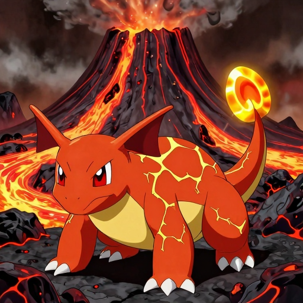
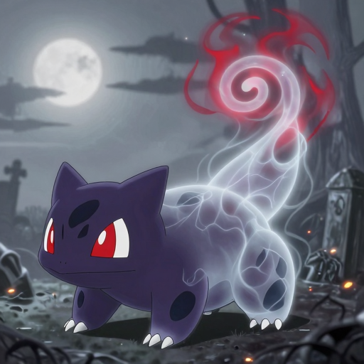
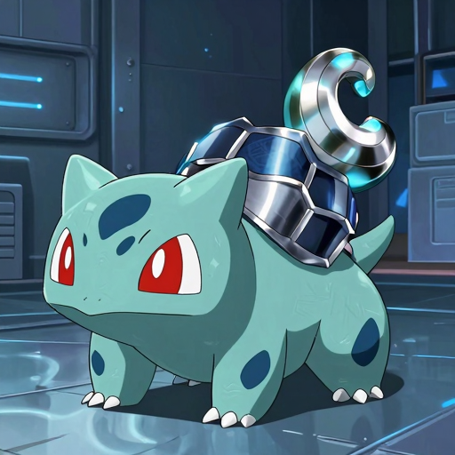
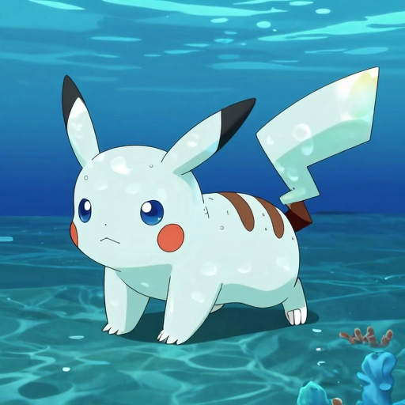
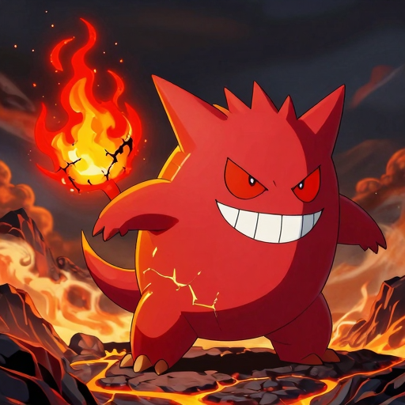
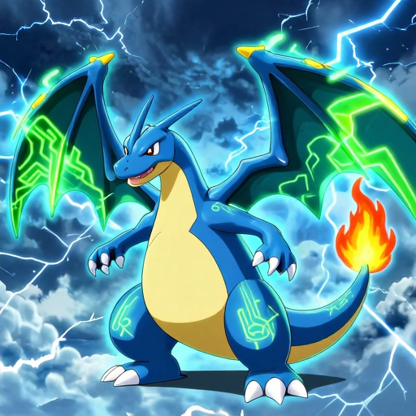

# PokeAIchemize

> Reimagina los 150 Pokémon de la Gen 1 cambiando su tipo base con LLMs locales y generación de imágenes por GPU.

Cada Pokémon es analizado por un agente de visión, transformado por 5 especialistas LLM y renderizado con Z-Image-Turbo en estilo Ken Sugimori. El resultado es una Pokédex web estática con hasta 2 700 sprites reimaginados (150 Pokémon × 18 tipos).

---

## Demo

| Bulbasaur → Fire | Bulbasaur → Ghost | Bulbasaur → Steel |
|:---:|:---:|:---:|
|  |  |  |

| Pikachu → Water | Gengar → Fire | Charizard → Electric |
|:---:|:---:|:---:|
|  |  |  |

---

## Stack

| Capa | Tecnología |
|---|---|
| LLM (agentes de texto) | Ollama — `qwen3:30b-a3b` |
| Visión (análisis de sprites) | Ollama — `qwen2.5vl:7b` |
| Generación de imágenes | Z-Image-Turbo (`Tongyi-MAI/Z-Image-Turbo`) |
| Frontend | HTML / CSS / JS estático |
| Orquestación | Python puro |
| Aislamiento | Docker + docker-compose + GPU (RTX 4080) |

---

## Requisitos

- Docker con soporte NVIDIA GPU (`nvidia-container-toolkit`)
- [Ollama](https://ollama.com/) instalado en el host con los modelos `qwen3:30b-a3b` y `qwen2.5vl:7b`
- WSL2 (si usás Windows)

---

## Inicio rápido

### 1. Iniciar Ollama

```powershell
# Windows PowerShell
$env:OLLAMA_HOST = "0.0.0.0"
$env:OLLAMA_NUM_PARALLEL = "6"
ollama serve
```

### 2. Levantar el container

```bash
docker compose up -d
```

### 3. Correr el pipeline

```bash
docker exec -d pokeaIchemize_pipeline sh -c "cd /app && PYTHONPATH=/app python3 pipeline/batch_runner.py >> /app/run.log 2>&1"
```

### 4. Generar el bundle para la web

```bash
PYTHONPATH=. python3 pipeline/10_bundle_builder.py
```

### 5. Ver la web

```bash
python3 -m http.server 8080
# → http://localhost:8080/web/
```

---

## Cómo funciona el pipeline

```
sprite original (data/sprites/{id}.png)
        │
        ▼
  E1  01_pokemon_analyst      → análisis visual: identity_traits, anchor_phrases
        │
        ▼
  E2  02_type_designer        → vocabulario visual por tipo: palette, skin, accent, background
        │
        ▼
  C   03–07 Especialistas     → 5 agentes en paralelo (anatomía, estilo, pose, negativos)
        │
        ▼
  E3  08_prompt_conciliator   → prompt final ensamblado (budget 77 tokens CLIP)
        │
        ▼
  D   09_image_generator      → sprite reimaginado 512×512 PNG
        │
        ▼
  E5  10_bundle_builder       → web/data/bundle.json para la Pokédex
```

---

## Configuración (`config.py`)

| Variable | Valor | Descripción |
|---|---|---|
| `DEV_POKEMON_IDS` | 50 Pokémon | IDs a procesar (vacío = todos los 150) |
| `DEV_TYPE_NAMES` | `["fire","water","ghost","steel","electric","fairy"]` | Tipos a generar |
| `OLLAMA_MODEL` | `qwen3:30b-a3b` | Modelo LLM para agentes de texto |
| `OLLAMA_VISION_MODEL` | `qwen2.5vl:7b` | Modelo de visión para E1 |
| `ZIMAGE_MODEL` | `Tongyi-MAI/Z-Image-Turbo` | Modelo de generación de imágenes |
| `IMAGE_WIDTH/HEIGHT` | `512 × 512` | Resolución de los sprites generados |

---

## Estructura

```
PokeAIchemize/
├── data/               # Datos fuente: pokemons.json, types.json, sprites/
├── pipeline/           # Agentes del pipeline (01–11) + batch_runner.py
├── outputs/            # Salidas generadas (gitignored)
│   ├── images/         # {name}_{type}.png — sprites generados
│   └── ...             # prompts, partes, análisis E1/E2
└── web/                # Frontend estático (Pokédex TypeDex)
    ├── index.html
    ├── css/ js/ data/
    └── outputs/moves/  # Movimientos temáticos por tipo
```

---

## Licencia

Proyecto personal de investigación. Los sprites originales son propiedad de Nintendo / Game Freak.
