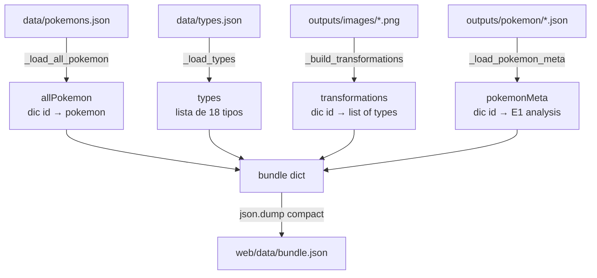

# Bundle Builder (E5)

Genera `web/data/bundle.json`, el archivo de datos consolidado que consume el frontend TypeDex. Fusiona cuatro fuentes del pipeline en un único JSON listo para ser servido estáticamente.

---

## Workflow



1. **_load_all_pokemon** — Lee `data/pokemons.json` (lista), convierte a dict keyed por `id`.
2. **_load_types** — Lee `data/types.json` tal cual (lista de 18 tipos).
3. **_build_transformations** — Escanea `outputs/images/*.png`, parsea el stem `{id}_{type}`, agrupa por id y devuelve lista de tipos ordenada alfabéticamente.
4. **_load_pokemon_meta** — Lee todos los `outputs/pokemon/{id}.json` (salidas de E1) en un dict keyed por id.
5. Escribe el bundle compactado (sin espacios) a `web/data/bundle.json`.

---

## Inputs

| Fuente | Path | Descripción |
|---|---|---|
| Pokémon base | `data/pokemons.json` | Lista de 150 Pokémon con id, nombre, tipos originales |
| Tipos | `data/types.json` | 18 tipos con morph_traits, palette, skin_material, etc. |
| Imágenes generadas | `outputs/images/{id}_{type}.png` | Presencia de archivo determina qué combos están disponibles |
| Análisis E1 | `outputs/pokemon/{id}.json` | identity_traits, anchor_phrases, transformable_parts por Pokémon |

---

## Output

**`web/data/bundle.json`** — JSON compacto (sin pretty-print) con estructura:

```json
{
  "allPokemon": {
    "001": { "id": "001", "name": "bulbasaur", "types": ["grass", "poison"], ... },
    ...
  },
  "types": [
    { "name": "fire", "morph_traits": "...", "palette": "...", ... },
    ...
  ],
  "transformations": {
    "025": ["electric", "fire", "ghost"],
    ...
  },
  "pokemonMeta": {
    "025": {
      "identity_traits": [...],
      "anchor_phrases": [...],
      "transformable_parts": [...],
      ...
    },
    ...
  }
}
```

- `transformations` solo contiene ids de Pokémon que tienen al menos una imagen generada. Si el dict está vacío, la web muestra todos los Pokémon como "bloqueados".
- `pokemonMeta` contiene solo los ids para los que E1 fue ejecutado (subconjunto de los 150).

---

## Cómo ejecutar

```bash
# Desde la raíz del proyecto (fuera de Docker):
PYTHONPATH=. python3 pipeline/10_bundle_builder.py
```

Debe correrse **después** de cada run del pipeline para que `transformations` refleje las imágenes nuevas.

---

Source: `pipeline/10_bundle_builder.py`
