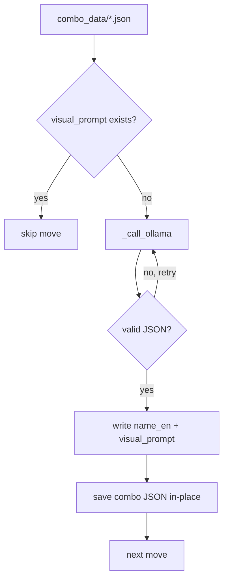

# Move Enricher

Enriches `combo_data` move entries with English name and visual prompt fields used by `13_move_illustrator.py` to generate distinct banner images per move.

## Workflow



1. Load all `combo_data/*.json` filtered to combos with a rendered image (`bundle.json transformations`).
2. Pre-load `types_visual/{type}.json` for all types (palette and background context).
3. For each combo file, iterate its `moves` array (up to 4 moves per combo).
4. Skip moves that already have `visual_prompt`.
5. Call Ollama (`qwen3:30b-a3b`) with move name + description (ES) + type palette/environment.
6. Write `name_en` and `visual_prompt` back to the move dict.
7. Save the combo JSON in-place only if at least one move was enriched.
8. Retry failed calls up to `_MAX_RETRIES = 3` times per move.

## Inputs

| Source | Description |
|---|---|
| `docs/outputs/combo_data/{id}_{type}.json` | Move list generated by `11_combo_data_writer.py` |
| `docs/data/bundle.json` | Filter: only combos with a rendered transformation image |
| `docs/outputs/types_visual/{type}.json` | Type palette and background for prompt context |

## Outputs

`docs/outputs/combo_data/{id}_{type}.json` — updated in-place. Each move entry gains two fields:

```json
{
  "name": "Relámpago de Hojas",
  "desc": "...",
  "name_en": "Electric Leaf Bolt",
  "visual_prompt": "crackling electric-blue leaves, glowing neon green energy trails, yellow lightning sparks, white electric arcs"
}
```

## Ollama prompt structure

- **System**: VFX artist role, strict rules — no characters, English only, under 60 words, comma-separated list.
- **User**: move name (ES) + description (ES) + elemental type + type color palette + type environment.
- **Format**: `json`, `think: false`, `/no_think` prefix.
- **Required keys**: `name_en`, `visual_prompt`.

## Code Reference

Source: `pipeline/12_move_enricher.py`

| Symbol | Description |
|---|---|
| `run()` | Public entry point — called by `batch_runner.py` Phase E |
| `_enrich_combo(combo_path, type_visual)` | Enriches all moves in one file, returns count enriched |
| `_call_ollama(move, type_name, type_visual)` | Single Ollama call, raises `RuntimeError` on failure |
| `_SYSTEM_PROMPT` | VFX artist system prompt with strict no-character rules |
